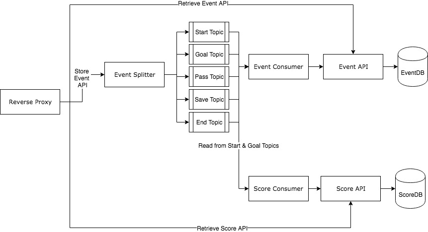

## Swift Medical Programming Challenge

# Assumptions
- The `start`, `pass`, `save`, `goal`, and `end` events have only a few required parameters. Sample payloads can be seen in `sample_payloads.json`
- The POST events request url: http://0.0.0.0:8080/events 
- The GET score request only requires `match_id`. For example: http://0.0.0.0:8080/score?match_id=ef4146ee-64e3-430b-b6af-b12671e4beef
- The GET events request url only requires `match_id` and `Format`. For example: http://0.0.0.0:8080/events?event_id=061371f1-eda5-4fea-96ee-000000000005&Format=yaml
- Sqlite db has been used to reduce application footprint on developer machine. This means that timezone-aware DateTime object will not be supported.
- Python web services currently do not support a production profile using gunicorn. 

# Architecture Diagram

# Architecture Overview
The architecture is built using event-driven principles. Kafka is utilized to organize Fifa events into separate topics. 

`Event Splitter` is responsible for publishing an event into a corresponding Kafka topic
`Event Consumer` is responsible for consuming events from all topics and sending them to `Event API` 
`Event API` is responsible for storing/retrieving raw event data
`Score Consumer` is responsible for consuming events from `start` and `goal` topics and sending them to `Score API`
`Score API` is responsible for managing/retrieving match related data like goals, saves, passes, etc.

# Environment Setup Instructions
1. Install Docker
2. Run `start.sh` script
3. Ensure all containers are running `docker ps -a`
4. Access the reverse proxy endpoint on port `8080` using either `localhost` or `0.0.0.0` depending on what operating system the host machine is using.

# Run Tests
1. Run `./run_tests.sh` after the environment is created.
